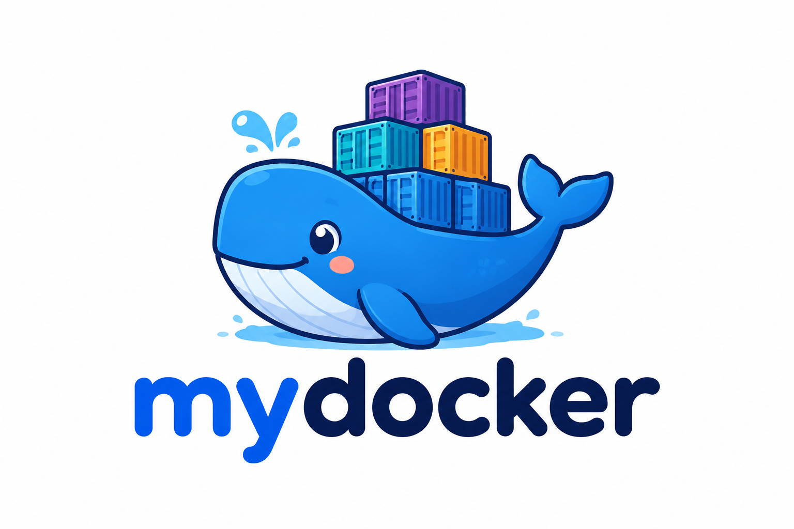
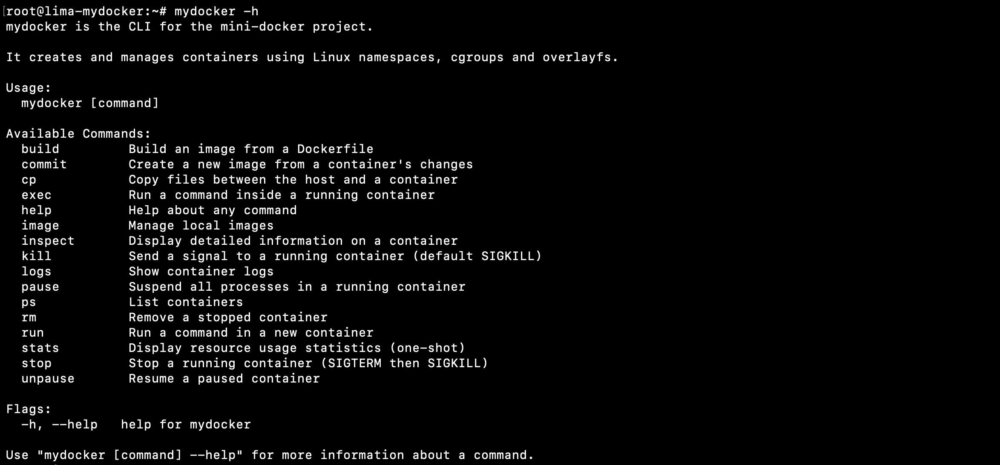
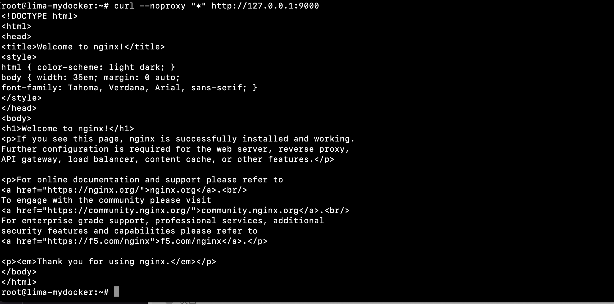
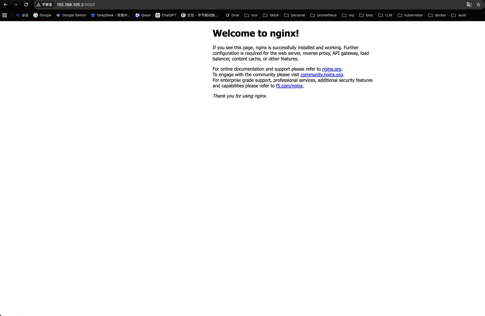
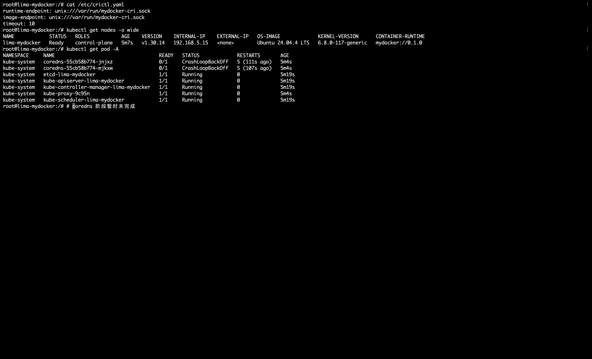

# mini-docker

A from-scratch container engine **and** Kubernetes CRI runtime, built for learning.

<p align="center">
  
</p>

这是一个 4 级递进的容器化实现：

| Level | 目标 | 状态 |
|-------|------|------|
| L1 | Namespace + cgroup + rootfs 隔离（CLI） | ✅ |
| L2 | 完整 Docker 功能（image/network/volume/build/push 等） | ✅ 22/22 e2e |
| L3 | CRI gRPC Server（crictl 可用） | ✅ smoke 通过 |
| L4 | Kubelet + kubeadm 集成（标准 K8s 控制面） | ✅ kubeadm init 成功 |

Kubelet 接入指南见 [`scripts/kubelet-integration.md`](./scripts/kubelet-integration.md)。

---

## 目录结构

```
mini-docker/
├── cmd/
│   ├── mydocker/          # L1-L2：Docker 风格的 CLI
│   └── mydocker-cri/      # L3-L4：CRI gRPC 守护进程
├── pkg/
│   ├── namespace/         # clone flag、setns 辅助
│   ├── cgroup/            # cgroups v2 + systemd driver
│   ├── rootfs/            # pivot_root + overlayfs
│   ├── container/         # 容器生命周期（启动、init、wait）
│   ├── image/             # OCI 镜像 pull / push / overlay 组装
│   ├── network/           # libcni 封装 + 端口映射
│   ├── sandbox/           # Pod 沙箱（pause 进程 / hostNetwork）
│   ├── cri/               # CRI RuntimeService + ImageService
│   ├── store/             # 容器元数据持久化
│   ├── logger/            # CRI 规定的日志格式
│   └── ...
├── scripts/
│   ├── prepare-rootfs.sh      # 从 docker 镜像导出 rootfs
│   ├── install-cni.sh         # 安装标准 CNI 插件
│   ├── mydocker-cri.service   # systemd unit
│   ├── smoke-l1.sh            # L1 最小冒烟
│   ├── e2e-docker.sh          # L2 完整 Docker 功能测试（22 项）
│   ├── smoke-l3.sh            # L3 CRI 冒烟（sandbox/image/container/exec）
│   ├── standalone-kubelet.sh  # L4A 独立 kubelet + static pod
│   ├── kubeadm-e2e.sh         # L4B kubeadm init 完整集群
│   └── kubelet-integration.md # L4 部署与排查手册
└── ...
```

---

## 开发环境

- 代码可在 Windows / macOS / Linux 编辑
- **运行必须在 Linux**（推荐 Ubuntu 22.04+，cgroups v2 + systemd）。
  Mac/Windows 上构建出的二进制只能跑 `pull` / `images` / `rmi` 这种纯逻辑命令；
  `run` / `exec` / CRI server 一动就报错（namespaces / cgroups / overlayfs 是 Linux 独占）
- Go 1.21+（当前项目使用 1.24）
- 构建工具：[Task](https://taskfile.dev)（已替代 Makefile）
  ```bash
  brew install go-task         # macOS
  # 或: go install github.com/go-task/task/v3/cmd/task@latest
  ```

### macOS 开发环境（lima + vmnet）

macOS 用户推荐用 [lima](https://lima-vm.io) 起 Linux VM。Taskfile 内置了一组
`vm:*` 任务可以一键搭好——只需要装好 `lima`：

```bash
brew install lima           # 一次性
```

然后：

```bash
task vm:doctor              # 体检：检查 lima / socket_vmnet / sudoers 状态
task vm:setup-vmnet         # 一次性：装 socket_vmnet 到 /opt + 写 sudoers（需要密码）
task vm:fresh               # 创建 ubuntu-lts VM 并启用 vmnet shared
task vm:install-mydocker    # VM 内构建 + install mydocker + 装 CNI 插件
task vm:shell               # 进入 VM
task vm:reset-net           # VM 重启后清干净 iptables / CNI / 容器残留
```

**为什么要 vmnet？** lima 默认是 user-mode 网络，VM 拿到的 `192.168.5.x` 在 Mac 上不可达，
要访问 VM 的容器只能写 `portForwards` 一对一映射。开 vmnet shared 后 VM 多出 `lima0` 接口
拿到 `192.168.105.x`，**Mac 直接 ping/curl 这个 IP 通**，不需要 portForward：

```bash
# 在 VM 内
sudo mydocker run -d -p 8080:80 nginx

# Mac 上直接 curl（如果 Mac 有 http_proxy，加 --noproxy '*'）
curl --noproxy '*' http://192.168.105.2:8080
```

如果还想让 Mac 直接访问容器 IP（10.22.x.x），加一条静态路由（重启失效）：

```bash
sudo route -nv add -net 10.22.0.0/16 192.168.105.2
```

> ⚠️ `vm:setup-vmnet` 是一次性的，第二次运行无害但要重输密码。

### 不用 lima 的其它选项

- multipass、UTM、Vagrant、Parallels：自己手动起 Ubuntu VM，把 `bin/` scp 进去
- 远程 Linux：`task build:linux` 交叉编译，`scp` 到目标机器

## 构建

```bash
task                    # 列出全部可用任务
task build              # 本机构建（非 Linux 平台会打 WARN）
task build:linux        # 交叉编译到 linux/amd64，产物 bin/mydocker{,-cri}
task build:linux-arm64  # 交叉编译到 linux/arm64
task vet                # 静态检查
task test               # 单元测试（所有 _test.go）
task clean              # 清理 bin/

# 运行类（仅 Linux）
task smoke:l1           # L1 namespace + cgroup + rootfs 冒烟
task e2e:docker         # L2 完整 Docker 功能 e2e（22 项）
task smoke:l3           # L3 CRI 冒烟
task e2e:kubeadm        # L4B kubeadm init 端到端
```

---

## Level 1：最小隔离容器

```bash
# 准备一个 rootfs（从 busybox 镜像导出）
sudo ./scripts/prepare-rootfs.sh ./rootfs-busybox busybox:latest

# 跑一个带 PID/UTS/Mount namespace + cgroup 限制的 shell
sudo ./mydocker run -it \
    --rootfs ./rootfs-busybox \
    --name demo \
    --hostname demo \
    --memory 100m \
    --cpus 0.5 \
    /bin/sh
```

容器内部：
- `ps` 只看到自己的进程（PID ns）
- `hostname` 显示 `demo`（UTS ns）
- `ls /` 是 rootfs 的内容（mount ns + pivot_root）
- 在宿主机看 `/sys/fs/cgroup/demo/memory.max` 能看到 100MiB 限制

快速验证：

```bash
sudo ROOTFS=./rootfs-busybox ./scripts/smoke-l1.sh
```

CLI 长这样：

<p align="center">
  
</p>

---

## Level 2：完整 Docker 功能

Level 2 在 L1 基础上补齐 image pull / push、桥接网络、端口映射、volume、commit、build、inspect、exec、stats、kill、pause 等用户日常会用到的 Docker 子命令。

### 快速验证（22 项端到端）

```bash
# 装二进制 + CNI 插件
sudo install -m 0755 bin/mydocker /usr/local/bin/mydocker
sudo ./scripts/install-cni.sh

# 跑完整 e2e
sudo bash scripts/e2e-docker.sh
```

e2e 覆盖：
- image pull / ls / tag
- run -it 前台、run -d 后台
- 桥接网络 + 端口映射（httpd on :80 → host :7777，curl 通）
- volume 挂载、环境变量、-c 命令
- exec / logs / inspect / ps / stats
- pause / unpause / kill / restart
- cp 拷贝文件进出容器
- commit 提交成新镜像，镜像落地可重新 run
- build（Dockerfile）
- save / load
- push / pull（需要配置 registry，跳过时打 skip）

### Demo：起 nginx + 端口映射

```bash
sudo mydocker image pull nginx
sudo mydocker run -d --name web -p 8080:80 nginx
curl --noproxy '*' http://192.168.105.2:8080      # macOS 宿主机直连 lima VM
```

宿主 `curl` 拿到 nginx 默认页：

<p align="center">
  
</p>

浏览器访问同一地址：

<p align="center">
  
</p>

<p align="center">
  
</p>

---

## Level 3：CRI gRPC Server

`mydocker-cri` 实现 Kubernetes CRI v1，可以被 `crictl` 直接驱动。

### 部署

```bash
# 二进制到位
sudo install -m 0755 bin/mydocker-cri /usr/local/bin/mydocker-cri
sudo install -m 0755 bin/mydocker      /usr/local/bin/mydocker

# systemd 托管
sudo install -m 0644 scripts/mydocker-cri.service /etc/systemd/system/
sudo systemctl daemon-reload
sudo systemctl enable --now mydocker-cri
sudo systemctl is-active mydocker-cri   # active

# CNI 插件（让 Pod 能拿到 IP）
sudo ./scripts/install-cni.sh
```

### crictl 配置

```bash
sudo tee /etc/crictl.yaml >/dev/null <<'EOF'
runtime-endpoint: unix:///var/run/mydocker-cri.sock
image-endpoint: unix:///var/run/mydocker-cri.sock
timeout: 10
EOF

sudo crictl info | head -20
# RuntimeReady=true、NetworkReady=true
```

### 冒烟测试

```bash
sudo bash scripts/smoke-l3.sh
```

覆盖：
- Version / Status RPC
- RunPodSandbox + PodSandboxStatus + IP 分配
- PullImage + ImageStatus + ListImages
- CreateContainer + StartContainer + ContainerStatus
- ExecSync（同步命令）
- StopContainer + RemoveContainer
- StopPodSandbox + RemovePodSandbox

---

## Level 4：接入 Kubelet / kubeadm

两条路径，都已打通：

### 4A：独立 Kubelet + Static Pod（快速验证 CRI 协议）

不依赖 apiserver，kubelet 直接读 `/etc/kubernetes/manifests/*.yaml` 创建 Pod。

```bash
sudo bash scripts/standalone-kubelet.sh
```

13 项检查，覆盖：sandbox → container → 网络 → 镜像拉取 → Pod 自恢复。

### 4B：kubeadm init 完整 K8s 控制面

真正的 Kubernetes 集群，以 mydocker-cri 为底层 runtime。

```bash
# 一键端到端
sudo bash scripts/kubeadm-e2e.sh
```

验证：
- `kubeadm init` 8 秒内 API server healthy
- `kubectl get nodes` → Ready
- `kubectl get nodes -o wide` → CONTAINER-RUNTIME 显示 `mydocker://0.1.0`
- etcd / kube-apiserver / kube-controller-manager / kube-scheduler 全部 Running

详细部署流程、systemd unit、cgroup driver 配置、常见坑见 [`scripts/kubelet-integration.md`](./scripts/kubelet-integration.md)。

#### 典型输出

```
[api-check] The API server is healthy after 8.507231s
Your Kubernetes control-plane has initialized successfully!

NAME           STATUS   ROLES           AGE   VERSION    INTERNAL-IP     CONTAINER-RUNTIME
mydocker-dev   Ready    control-plane   98s   v1.30.14   192.168.252.2   mydocker://0.1.0
```

---

## 调试

### mydocker-cri 日志

```bash
# 文件日志（比 journald 全）
sudo tail -f /var/log/mydocker-cri.log

# RPC 拦截器输出每个调用的方法名、耗时、错误
# [CRI] /runtime.v1.RuntimeService/RunPodSandbox OK (1.944ms)
# [CRI] /runtime.v1.RuntimeService/ContainerStatus ERR no such container (...) (58µs)
```

默认过滤 List/Status 这种高频 RPC 只在出错时打印，避免噪音。

### Kubelet 日志

```bash
sudo journalctl -u kubelet -f
sudo journalctl -u kubelet --since '5 min ago' --no-pager
```

### 容器日志

```bash
# CRI 格式（kubectl logs / crictl logs 都走这个）
sudo cat /var/log/pods/<namespace>_<pod>_<uid>/<container>/<attempt>.log

# mydocker CLI 场景
sudo mydocker logs <container>
```

### 常见坑

- **cgroup driver 不一致**：Kubelet 默认 systemd，mydocker-cri 必须同步（`--cgroup-driver=systemd`）
- **CNI 不通**：`/etc/cni/net.d/` 要有 conflist，`/opt/cni/bin/` 要全
- **端口 10250 占用**：前一次 kubelet 没停，`systemctl stop kubelet` 再 `kubeadm reset`
- **hostNetwork Pod 状态**：sandbox 的 NetnsPath 必须是 `/proc/1/ns/net`，NamespaceOption.Network 必须是 `NODE`（非 `POD`）——否则 Kubelet 会无限重建 Pod

---

## 里程碑

- [x] L1：`mydocker run` 能起一个带 PID/UTS/Mount ns 和 cgroup v2 限制的 shell
- [x] L2：端到端 22/22 跑通（image/network/volume/build/commit/push/save 全通）
- [x] L3：`crictl info`、`crictl pull`、`crictl runp/create/start/exec` 全通
- [x] L4A：standalone kubelet 从 manifest 把 Pod 拉起来、自恢复、外部能 curl
- [x] L4B：**`kubeadm init` 在 mydocker-cri 上拉起完整控制面**（etcd + apiserver + controller-manager + scheduler）
- [x] CoreDNS / kube-system 全 Pod Running（容器 `/etc/{resolv.conf,hosts,hostname}` 由 mydocker-cri 注入）
- [x] **多节点 `kubeadm join`**（两个 lima VM，control-plane + worker，都跑 `mydocker://0.1.0`）
- [x] 多节点 nginx Deployment 调度 + ClusterIP / NodePort Service：scheduler / kube-proxy / DNS / iptables 全部端到端工作
- [x] **`kubectl logs` 工作**（CRI log format `<RFC3339Nano> <stream> <P|F> <line>` 包装在 `pkg/container/crilog.go`）

### 已知限制

- **跨节点 Pod 网络不通**：mydocker 的 CNI 是 `bridge + host-local IPAM`（单节点教学版），
  每个节点都拿 `10.22.0.0/16` 整段，没有节点间路由。生产 K8s 通过 Flannel /
  Calico / Cilium 这类"集群级 CNI"解决。所以当一个 Pod 落在 worker 上、
  Service 流量被 DNAT 到它时，从 CP 访问会 timeout。把 Deployment 钉到单节点
  （`nodeSelector`）就 100% OK。

  下一阶段（如有）：实现 per-node subnet + VXLAN，或者直接接现成的 Flannel。

---

## License

MIT
